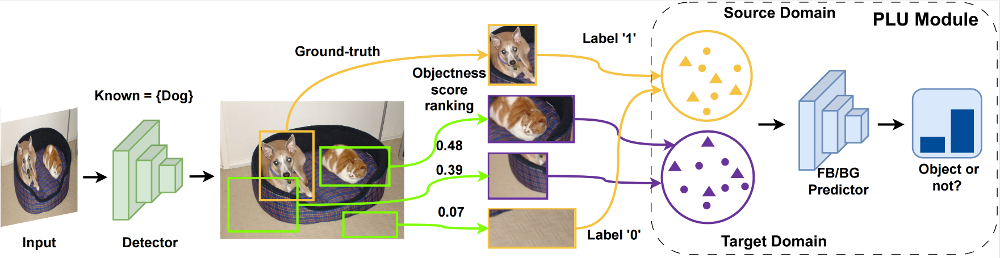
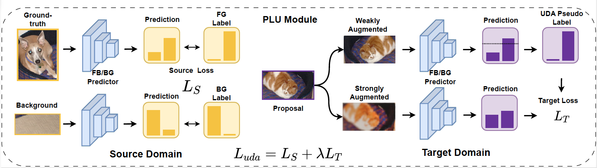

## Proposal-Level Unsupervised Domain Adaptation for Open World Unbiased Detector [[arXiv](https://arxiv.org/pdf/2311.02342)]

<p align="center" width="100%">

</p>

<p align="center" width="80%">
The figure shows the overall structure of PLU.
</p>

<p align="center" width="100%">

</p>

<p align="center" width="80%">
The figure shows how PLU module works(use fixmatch as example).
</p>


#### Abstract
Open World Object Detection (OWOD) combines open-set object detection with incremental learning capabilities to handle the challenge of the open and dynamic visual world. Existing works assume that a foreground predictor trained on the seen categories can be directly transferred to identify the unseen categories' locations by selecting the top-k most confident foreground predictions. However, the assumption is hardly valid in practice. This is because the predictor is inevitably biased to the known categories, and fails under the shift in the appearance of the unseen categories. In this work, we aim to build an unbiased foreground predictor by re-formulating the task under Unsupervised Domain Adaptation, where the current biased predictor helps form the domains: the seen object locations and confident background locations as the source domain, and the rest ambiguous ones as the target domain. Then, we adopt the simple and effective self-training method to learn a predictor based on the domain-invariant foreground features, hence achieving unbiased prediction robust to the shift in appearance between the seen and unseen categories. Our approach's pipeline can adapt to various detection frameworks and UDA methods, empirically validated by OWOD evaluation, where we achieve state-of-the-art performance.

## Installation
1. Clone the repo
```
git clone https://github.com/lxycopper/PLU.git
cd PLU
```
2. Create conda environment and install dependencies
```
# create environment
conda create -n plu python=3.10
conda activate plu
pip install torch==1.7.0+cu110 torchvision==0.8.0+cu110 torchaudio==0.7.0 -f https://download.pytorch.org/whl/torch_stable.html

## install detectron2 according to the CUDA and torch versions
python -m pip install detectron2==0.5 -f https://dl.fbaipublicfiles.com/detectron2/wheels/cu110/torch1.7/index.html
python -m pip install -e ./

## install other packages
pip install reliability shortuuid

```
Other detectron2 versions can be found here: [detectron2](https://github.com/facebookresearch/detectron2/releases). We recommend directly using pre-built version. The pre-built package has to be used with corresponding version of CUDA and official PyTorch release.

## Dataset
Download the required dataset in the `./datasets` folder.
   
## Quick Start 

You can run the code on a 4 GPU machine following the command:
```python
python tools/train_net.py --num-gpus 4 --config-file <Change to the appropriate config file> SOLVER.IMS_PER_BATCH 4 SOLVER.BASE_LR 0.005
```
All config files can be found in: `configs/OWOD`

Alternatively, you can run the bash script `run.sh` file for a task workflow.
```
bash run.sh
```


## Possible Issues:
1. No existing key: rerun detectron2 installation
```
python -m pip install -e ./
```

2. cannot find "R-50.pkl"
```
pip install fvcore==0.1.1.dev200512
```

3. other installation issues, you may refer to [Common Installation Issues](https://github.com/JosephKJ/OWOD/blob/master/INSTALL.md)
   


## :fountain_pen: Citation

   If you find our repo useful for your research, please consider citing our paper:

   ```bibtex
   @article{liu2023proposal,
    title={Proposal-Level Unsupervised Domain Adaptation for Open World Unbiased Detector},
    author={Liu, Xuanyi and Yue, Zhongqi and Hua, Xian-Sheng},
    journal={arXiv preprint arXiv:2311.02342},
    year={2023}
  }
  ```


## Acknowledgement
This project is built using the following open source repositories: [ORE](https://github.com/JosephKJ/OWOD)

